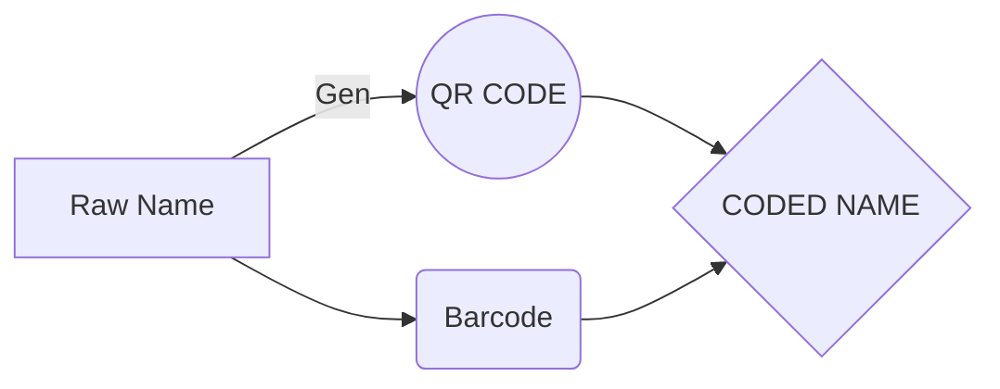

# Welcome to Barcode Generator & Scanner !

Hi! I'm glad to see you here  **Hamsoft uganda**. If you want to learn about how  you can make Barcodes and QR codes for your products , then this article is for you because it will answer and tick the boxes on your question list. If you want to generate codes for your products then start by  downloading  Barcode generator and scanner from [here](https://play.google.com/store/apps/details?id=com.hamsoftug.barcodegeneratorandscanner) , you can go ahead and install it on your android device . Once you have finished with installation, you can create new codes for your products  by opening the **App menu** on the left corner of the navigation bar.

-Generate Barcodes and or QR-code.  
-Scan Barcode and or QR-code.  
-Attach codes to your products and tracking.  
-Use google, phone number or any email to back up your codes instantly and recover them in case of device crash or lost.  
  
Support code formats:-  
--CODE_128  
--CODE_39  
--QR_CODE  
--PDF_417  
--UPC_EAN_EXTENSION

And this will produce a flow chart:

From hamsoft uganda news team, we hope you found this article helpful , kindly reach us via info@hamsoftug.com for any inquireris .
